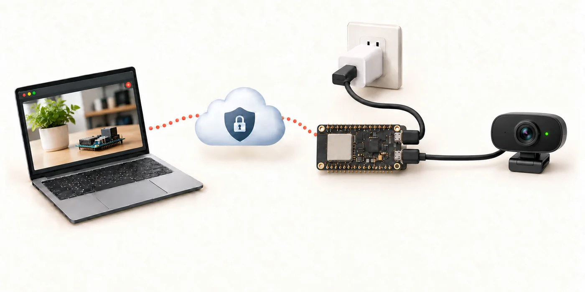
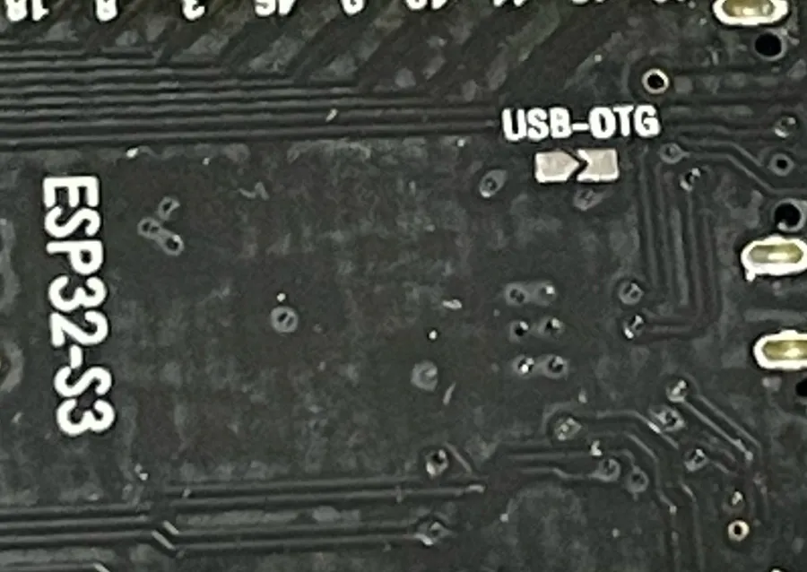

# usb-camera-over-tailscale

[日本語](README-ja.md)

An ESP32-S3 board with PSRAM that joins a tailnet on its own and serves one picture from a USB camera over HTTP: open `http://<hostname>/` from any device on the tailnet and get a JPEG.



```text
Browser ──Tailscale / http://<hostname>/──▶ ESP32-S3 ──USB host──▶ USB camera (UVC, MJPEG)
```

Everything a Tailscale node needs (control protocol, WireGuard, DERP, NAT traversal) is implemented in Rust in this repository.
Initial setup is an interactive shell over USB serial; flashing and setup are done from a browser, with nothing to install.
The project is the camera counterpart of [usb-serial-over-tailscale](https://github.com/signal-slot/usb-serial-over-tailscale) and shares its Tailscale node, setup shell and web installer.

## Status

Not yet verified on hardware.
The Tailscale node, the setup wizard, Wi-Fi handling and the web installer are inherited unchanged from usb-serial-over-tailscale, where they were tested on an N16R8 board.
The parts specific to this project (the UVC host driver integration, the on-demand stream and the HTTP server on the tailnet) have only been built.

Known limits:

- The ESP32-S3 is a full-speed USB host (12 Mbit/s). Cameras stream at a fraction of their USB 2.0 bandwidth, so frames come at a few per second at 640x480 and some cameras refuse to negotiate large sizes. Use `resolution` and `fps` to pick something the camera accepts; `camera` lists what it offers.
- Only MJPEG is used. A camera that offers only uncompressed (YUY2) formats is not supported; the board has no JPEG encoder budget for that.
- One request is served at a time. A browser reload waits for the previous one to finish.
- USB hubs are not supported; plug the camera in directly.

### Module variants

Flash size and PSRAM mode are build-time settings, so CI builds one image per ESP32-S3 module variant (`firmware/variants/`).
PSRAM is required: frame buffers, network thread stacks and TLS buffers live there.

| Variant | Flash | PSRAM | Partition table | Status |
| --- | --- | --- | --- | --- |
| N16R8 | 16 MB | 8 MB octal | `partitions.csv` (6 MB app) | built |
| N8R8 | 8 MB | 8 MB octal | `partitions.csv` | built |
| N4R8 | 4 MB | 8 MB octal | `partitions-4m.csv` (3 MB app) | built |
| N16R2, N8R2, N4R2 | 16, 8, 4 MB | 2 MB quad | as above | built |
| WROOM-2 N16R8V, N32R8V | 16, 32 MB octal | 8 MB octal | `partitions.csv` | built |
| N4, N8, N16 (no PSRAM) | | none | | not supported |

The WROOM-1U (external antenna) uses the same variants as the WROOM-1. The MINI-1 N4R2 matches `n4r2`.

To build a variant locally, point esp-idf-sys at its defaults file and pass the variant to the image script:

```bash
cd firmware
ESP_IDF_SDKCONFIG_DEFAULTS="sdkconfig.defaults;variants/n8r2.defaults" cargo build --release
tools/mkimage.sh n8r2 release
```

## Layout

| Path | Role |
| --- | --- |
| `crates/tsnode` | Tailscale node: control plane (ts2021 Noise and a minimal HTTP/2), WireGuard, DERP, disco, STUN, TCP termination with smoltcp. Runs on a host and on ESP-IDF. |
| `crates/adapter-core` | Interactive setup shell, the HTTP request/response handling of the snapshot server and the UVC control tables (descriptor parsing, parameter names, value encoding). I/O and device operations are traits, so all of it is unit-tested on the host. |
| `tools/hostnode` | Runs tsnode on Linux for verification: joins a real tailnet and serves the snapshot server with a built-in test image. |
| `firmware` | ESP32-S3 firmware (esp-idf-svc): setup console, USB host (UVC streaming and controls), Wi-Fi, Tailscale node, HTTP server. |

tsnode is split into these modules.

| Module | Contents |
| --- | --- |
| `controlbase`, `h2`, `control` | `/key` fetch, Noise IK handshake over `POST /ts2021`, `/machine/register` and `/machine/map` over HTTP/2. `/key` is always TLS; the Noise transport tries plain :80 first and falls back to TLS. |
| `wireguard` | Noise IKpsk2 handshake (initiator and responder), transport, replay window, rekey and keepalive timers. |
| `derp` | DERP relay client (TLS, fast-start, ping/pong, NotePreferred). |
| `disco`, `stun` | ping, pong and call-me-maybe for direct paths; public endpoint discovery with STUN. |
| `magicsock` | Path selection between UDP and DERP, handshake handling, peer table. |
| `netstack` | TCP termination on the tailnet addresses with smoltcp. |
| `node` | Ties the above together in threads. Keys persist in NVS or a file. |

## Usage

### Prepare the board (soldering required)

Use an ESP32-S3 board with PSRAM and two USB-C ports (COM and native USB).
Short the `USB-OTG` solder pad on the back of the board (shown below before bridging).


This is required: it feeds 5 V from the board to the camera, and without it the camera never powers up and is never detected.
The two ports have fixed roles: **`COM` = 5 V power in** (a charger or a PC), **`USB` = the camera**. Only for flashing and setup does `USB` go to the PC instead.
See "Power and wiring" below for the safety rule that follows from it.

### Flash from a browser

Open [signal-slot.github.io/usb-camera-over-tailscale](https://signal-slot.github.io/usb-camera-over-tailscale/) in Chrome or Edge to flash and configure the board without installing anything.
The page opens the board's USB Serial/JTAG port with WebSerial and writes the CI-built binaries with ESP Web Tools (esptool-js).
A terminal on the same page runs the setup wizard.
It works on Windows 10 and later, macOS, Linux and ChromeOS; it does not work in Firefox, Safari or on phones.
Connect the native USB port. The COM port (CH343) needs a driver on Windows and is not used.

Pick the module variant on the page from the marking on the module's metal can (for example `ESP32-S3-WROOM-1-N16R8`).
CI (GitHub Actions) builds every variant on each push. Tags matching `v*` also attach `usb-camera-over-tailscale-<variant>.bin` (bootloader, partition table and app merged into one file) to a release.
The merged file can be written with `esptool write_flash 0x0`, but it also overwrites the NVS area with 0xFF, which erases the configuration and registration.
Updates from the page write only the three regions and keep the configuration.

### Initial setup

An unconfigured board plugged into a PC through the native USB port shows up as a USB serial port (Espressif USB JTAG/serial, 303a:1001).
Open it in a terminal and press Enter to start the wizard.

```bash
screen /dev/ttyACM0 115200
```

```text
usb-camera-over-tailscale 0.1.0 - setup mode
Press Enter to start setup, or type a command:
=== Setup ===
Scanning Wi-Fi...
   1) home-wifi        (-48 dBm)
Select network number, or type an SSID (Enter to rescan, q to quit): 1
Password for home-wifi: ********
Connected (192.168.1.42)
Hostname on the tailnet [camera]:
Registering with Tailscale... (press q to stop waiting)
Open this URL in a browser to approve the device:
  https://login.tailscale.com/a/xxxxxxxx
Waiting for approval...
Tailscale is up: camera.example.ts.net 100.x.y.z
Setup complete. Reboot into normal mode now? [Y/n]
```

`setup` only adds a Wi-Fi network when the hostname and the Tailscale registration are already done.
`setup all` starts over.
To use an auth key, run `authkey tskey-auth-...` and then `login`.

The main commands are listed below; `help` prints the full list.

| Command | Description |
| --- | --- |
| `wifi <ssid> <pw>` | Add a Wi-Fi network and connect. Several can be stored; the strongest known AP is chosen at boot and on reconnect. |
| `wifi list`, `wifi forget <ssid>` | List and remove stored networks. |
| `port <n>` | TCP port of the HTTP server (default 80). |
| `resolution <WxH>`, `resolution auto` | Frame size to request from the camera. `auto` (the default) picks the MJPEG size closest to 640x480. A size the camera does not offer falls back to the closest one. |
| `fps <n>`, `fps auto` | Frame rate to request. `auto` takes the camera's default for that size; a rate the camera refuses falls back to it too. |
| `camera` | The attached camera's state and the sizes and rates it offers (normal mode, UART shell). |
| `snap` | Capture one frame and report its size and how long it took (normal mode, UART shell). |
| `status`, `reset`, `reboot` | Show status, erase configuration and keys, reboot. |

The same shell is always available on the UART port (115200 bps, shared with the log).
Press Enter to get a prompt.
Holding BOOT while powering on enters setup mode again.
Because the native USB port is the camera port in normal mode, `camera` and `snap` are only useful from the UART shell.

### Fetching a picture

From any device on the tailnet, open the hostname in a browser or fetch it with a tool.

```bash
curl -o snap.jpg http://camera/
```

Every request to `/` (also `/snapshot.jpg`) returns a freshly captured JPEG with `Cache-Control: no-store`.
`HEAD` works too; apart from `/controls` (below), other paths answer 404 and other methods 405.
Without a camera the server answers 503; if the camera is attached but delivers no frame within 8 seconds, 504 with the reason in the body.

### Camera settings

Query parameters on `/` set the camera's UVC controls before the frame is taken, and the settings stay until they are changed (they are re-applied if the camera is replugged, until the board reboots).
`/controls` returns the controls the camera supports, with the current value and the range, as JSON.

```bash
curl -o snap.jpg 'http://camera/?wb=auto&zoom=150&focus=80'
curl http://camera/controls
```

| Parameter | Control | Values |
| --- | --- | --- |
| `exposure` | Exposure time (Camera Terminal) | `auto`, or the time in 100 µs units; a number switches the camera to manual exposure. |
| `focus` | Focus | `auto` or a distance in the camera's units. |
| `zoom`, `iris`, `roll` | Zoom, iris, roll | A number in the camera's units. |
| `pan`, `tilt` | Pan and tilt | Signed numbers in the camera's units (1/3600 degree in the UVC standard). |
| `wb` | White balance | `auto` or a colour temperature in kelvin. |
| `hue` | Hue | `auto` or a signed number. |
| `brightness`, `contrast`, `saturation`, `sharpness`, `gamma`, `gain`, `backlight` | Processing Unit image controls | A number in the camera's units. |
| `powerline` | Power line frequency (anti-flicker) | `0`, `50` or `60`. |

Values are the raw UVC values, so their ranges differ between cameras; `/controls` shows `min`, `max`, `step` and `def` (the camera's default) for each.
A value outside the range, a parameter the camera does not support and a misspelt parameter are answered with 400 and a message; a request the camera rejects with 500.
Parameters are applied in the order given, so `wb=4500` after `wb=auto` wins.
After a change the next two frames are skipped so that the returned picture reflects the new setting.

The camera's stream is not running while nobody asks.
The first request starts it, the first two frames are skipped while exposure settles, and the next frame is returned; that takes up to a second or two depending on the camera.
The stream keeps running for 10 seconds after the last request, so a burst of requests gets frames without the start-up delay.

### Power and wiring

Power the board through the COM-side USB port, from a PC or a USB charger.
The native port is the USB host port for the camera; webcams are bus powered and draw their current from it.

To supply 5 V from the native port, bridge the `USB-OTG` solder pad on the back of the board (present on many DevKitC-1-compatible boards with two USB-C ports; boards without it need their own way of feeding VBUS to the native port).
This ties the VBUS of the two USB-C connectors together, so after bridging it **never plug both ports into PCs at the same time**.
For setup, connect only the native port to the PC; in normal operation, connect the COM port to power and the native port to the camera.
A 5 V supply of at least 1 A is advisable: a webcam can draw a few hundred milliamps on top of the board's Wi-Fi peaks.

## Building and flashing

Prerequisites are the `esp` toolchain installed with `espup`, `ldproxy` and `espflash`.
ESP-IDF v5.3.3 and the `espressif/usb_host_uvc` component are fetched into `firmware/.embuild/` on the first build (several GB, several minutes).

```bash
# host-side unit tests and verification tool
cargo test
cargo run -p hostnode -- probe-control                      # control-plane check (an AuthURL from a keyless registration is enough)
cargo run -p hostnode -- run --hostname tsnode-test        # join a real tailnet and serve the snapshot server with a test image (prints the approval URL)

# firmware
cd firmware
cargo build --release
cargo run --release      # espflash flash --monitor --flash-size 16mb --partition-table partitions.csv
```

Do not source `~/export-esp.sh`.
gcc and clang come from what esp-idf-sys installs into `.embuild/`; with espup's Xtensa gcc first on PATH the link fails.

The partition tables are `firmware/partitions.csv` (6 MB factory app, for 8 and 16 MB flash) and `firmware/partitions-4m.csv` (3 MB, for 4 MB flash).
To flash with esptool, build the binaries into `dist/<variant>/` with `tools/mkimage.sh <variant> release`.

```bash
cd firmware && tools/mkimage.sh n16r8 release
PY=$(ls -d .embuild/espressif/python_env/*/bin/python | head -1)
$PY -m esptool --chip esp32s3 --port /dev/ttyACM0 --baud 921600 write_flash \
  0x0 dist/n16r8/bootloader.bin 0x8000 dist/n16r8/partition-table.bin 0x10000 dist/n16r8/app.bin
```

The cargo runner pins the board's UART port to `/dev/ttyACM0`; adjust `.cargo/config.toml` for your machine.
`hostnode run` stores its keys in plain text in `hostnode-state.json`.

## Design decisions

- Capability version 106; map responses are received uncompressed. Headscale is not supported.
- Authentication defaults to the approval URL; an auth key is optional and is removed from NVS once registration succeeds.
- Tailscale ACLs (PacketFilter) are enforced on the receiving side. Every packet is dropped until the filter arrives.
- The home DERP region is chosen at boot by STUN round-trip time to each region, falling back to `tok` and then to the lowest region ID.
- Direct paths are established with disco ping/pong and call-me-maybe. The source of an authenticated UDP packet from a peer is also adopted as a path.
- WireGuard timestamps are corrected with the offset between the system clock and control time, and with SNTP.
- Network thread stacks and the camera's frame buffers live in PSRAM; only the control thread, which writes flash, keeps an internal-RAM stack.
- The camera is driven with Espressif's `usb_host_uvc` component. MJPEG frames are passed through as they are, so the board never decodes or encodes images.
- Camera settings are plain UVC class requests to the Camera Terminal and Processing Unit; the unit IDs are read from the configuration descriptor through a short-lived USB host client of our own, because the UVC driver keeps its device handle private. Settings use the raw UVC values rather than a normalised scale, so what `/controls` reports is exactly what the camera accepts.
- The stream runs on demand with a 10-second idle stop, instead of continuously: isochronous transfers cost CPU that Wi-Fi and WireGuard need, and a snapshot server has nothing to do with frames nobody asked for.
- Two frame buffers of half the raw 16-bit-per-pixel size each. A camera whose JPEGs are larger than that reports frame buffer overflows in the log; lower the resolution.

## Out of scope

Secure Boot and flash encryption, OTA, a web management UI, video streaming (MJPEG over HTTP), multiple simultaneous connections, uncompressed camera formats, USB hubs and a dedicated PCB.

## License

MIT.
The Tailscale and WireGuard protocol code was written from the protocol descriptions and the Tailscale (BSD-3-Clause) and wireguard-go (MIT) sources.
The firmware links Espressif's `usb_host_uvc` component (Apache-2.0).
